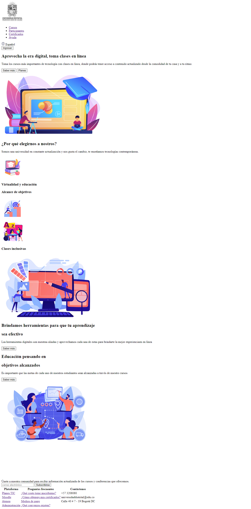
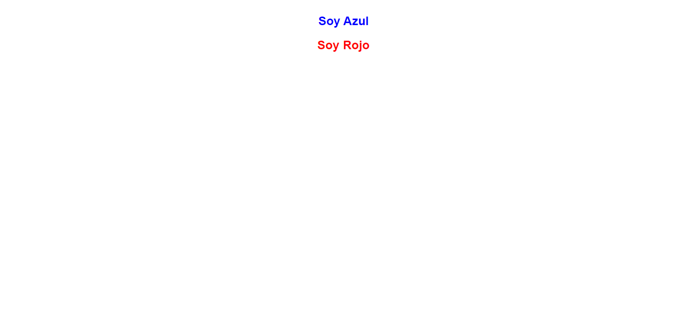
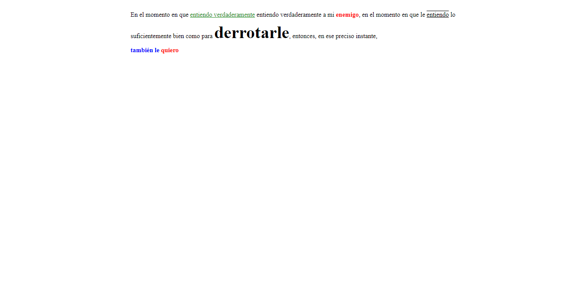
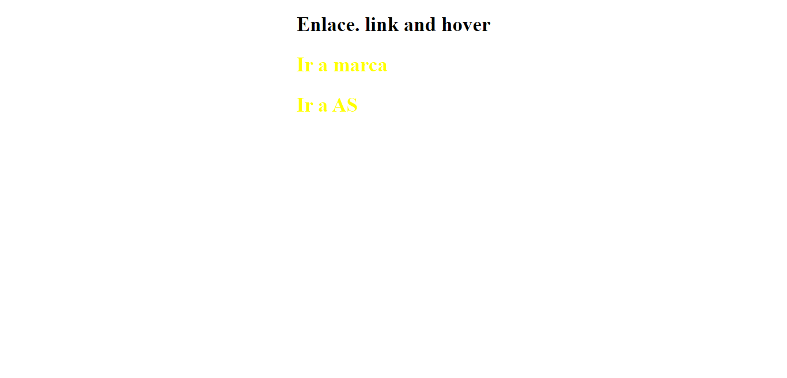
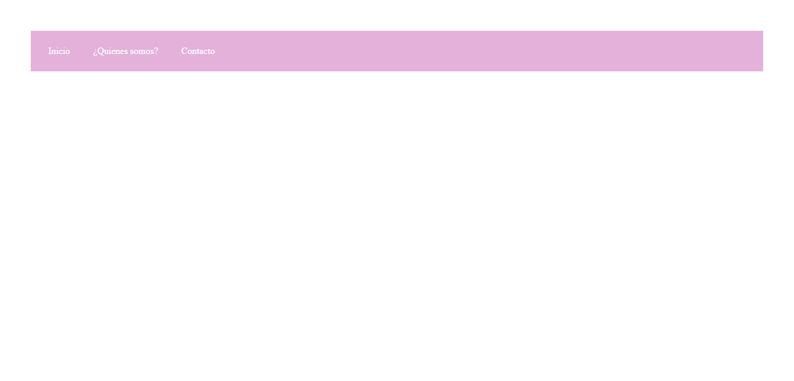
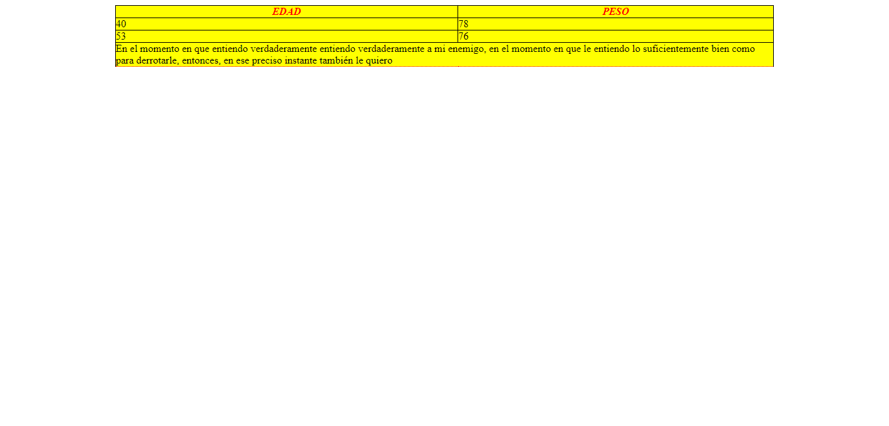

<h1>Taller 9 Diana Ladino</h1>

<h2> Información</h2>

Curso: full Stack Basico - Grupo 1

Profesor: Cristian Patiño

<h2> Punto 1: Link figma</h2>

<a href="https://www.figma.com/file/W4w5P74fmqzYxTQ3xVsKA2/Dise%C3%B1o-figma?type=design&node-id=16%3A183&t=ZAYQwzVbyj7woHOp-1" target="_blank">Link de Figma</a>

<h2> Punto 2: HTML</h2>

<h2> Punto 3: CSS</h2>

<h2> Punto 4: Textos azul y rojo</h2>

<h2> Punto 5: Textos diferentes</h2>

<h2> Punto 6: Links - hover</h2>

<h2> Punto 7-8: Menú</h2>

<h2> Punto 9: Tabla</h2>

<h2> Link</h2>

